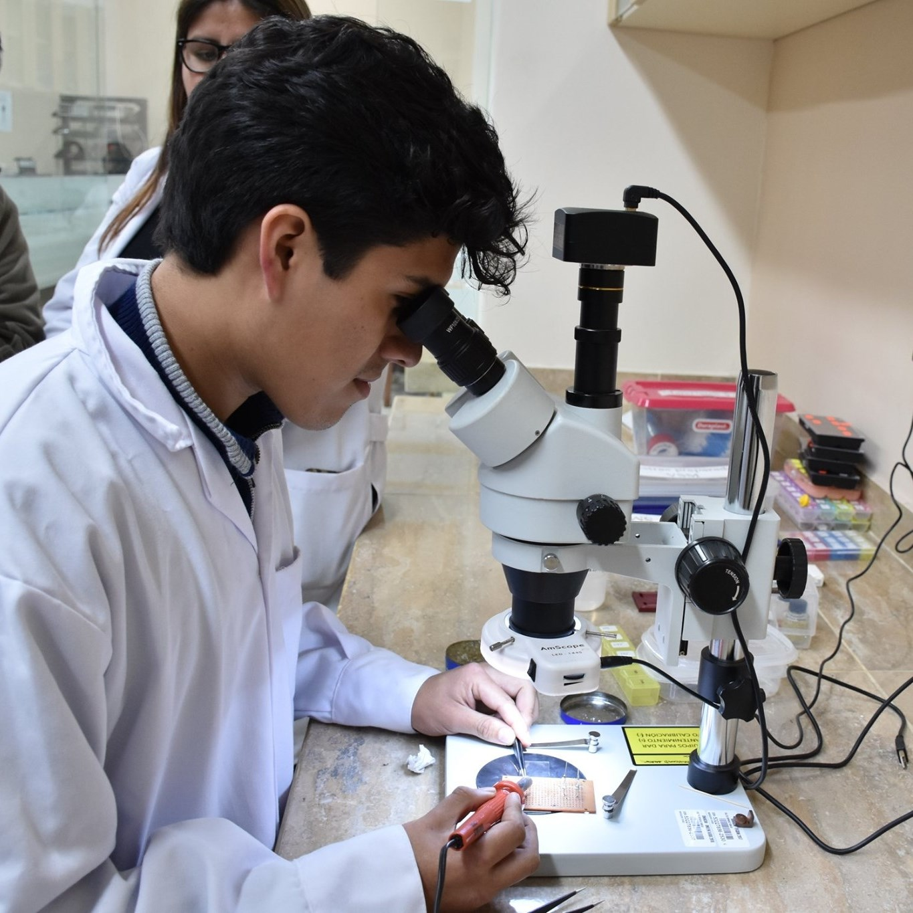

::: {.doublecolumn}
::: {.photo}
{alt="M. G. Pinedo Cuba"}
:::
::: {.info}
### Manuel Gustavo Pinedo Cuba, MSc

<i class="fas fa-envelope"></i> mgpinedocuba@outlook.com

<i class="fas fa-mobile-alt"></i> +51 971735570

<i class="fab fa-orcid"></i> [https://orcid.org/0000-0002-4263-6360](https://orcid.org/0000-0002-4263-6360)

<i class="fab fa-github"></i> [mgpinedocuba](https://github.com/mgpinedocuba)
:::
:::

## Work experience

::: {.job}
::: {.date}
2022 – 2025
:::
::: {.desc}
<i class="fas fa-bookmark"></i> Laboratory technician at the **Centro de Investigaciones Tecnológicas, Biomédicas y Medioambientales** (CITBM), Lima, Peru.
:::
:::

::: {.job}
::: {.date}
2020 – 2021
:::
::: {.desc}
<i class="fas fa-bookmark"></i> Practical instructor at the **Universidad Nacional Mayor de San Marcos** of the Electromagnetism I course.
:::
:::

## Education

::: {.job}
::: {.date}
2021 – 2023
:::
::: {.desc}
<i class="fas fa-bookmark"></i> **Master in Physics** with a mention in condensed matter physics. Facultad de Ciencias Físicas, Universidad Nacional Mayor de San Marcos.
:::
:::

::: {.job}
::: {.date}
2015 – 2019
:::
::: {.desc}
<i class="fas fa-bookmark"></i> **Degree in Physics** with a mention in material science. Facultad de Ciencias Físicas, Universidad Nacional Mayor de San Marcos.
:::
:::

## Scientific production

### Scientific articles

<ol class="poster-list">
<li>
<strong>Manuel G. Pinedo-Cuba</strong>, José M. Caicedo-Roque, Jessica Padilla-Pantoja, Justiniano Quispe-Marcatoma, Carlos V. Landauro, Víctor A. Peña-Rodríguez and José Santiso, <em>Epitaxial Growth of Ni-Mn-Ga on Al2O3(11-20) Single-Crystal Substrates by Pulsed Laser Deposition</em>. Surfaces 2025, 8(2), 35.

DOI: <a href="https://doi.org/10.3390/surfaces8020035" target="_blank">https://doi.org/10.3390/surfaces8020035</a>

</li>
<li>
Manuel Torres, <strong>Manuel Pinedo</strong>, Justiniano Quispe, and Carlos Landauro, <em>Implementación de un sistema de pulverización catódica con magnetrones de caras opuestas para el crecimiento de películas delgadas de hidroxiapatita</em>. Revista de Investigación de Física, 27(1).

DOI: <a href="https://doi.org/10.15381/rif.v27i1.25685" target="_blank">https://doi.org/10.15381/rif.v27i1.25685</a>

</li>
</ol>

### Poster and oral presentations

<ol class="poster-list">
<li>
<strong>M. G. Pinedo-Cuba</strong>, H. Tarazona, C. V. Landauro, and J. Quispe-Marcatoma, <em>Implementación del método de muestreo adaptativo para el estudio de propiedades magnéticas de nanopartículas de Fe y Co</em>. Poster presented in the IEEE NanoPerú 2023: Trends in Nanoscience and Nanotechnology, Lima, Perú, 2023.
</li>
<li>
J. Agüero, <strong>M. G. Pinedo-Cuba</strong>, M. Yactayo, J. Quispe-Marcatoma, and C. V. Landauro, <em>Implementación de un sistema de medida de resistividad en películas delgadas nanoestructuradas con interfase labview utilizando el método van der pauw</em>. Poster presented in the IEEE NanoPerú 2022, Lima, Perú.
</li>
<li>
M. Yactayo, <strong>M. G. Pinedo-Cuba</strong>, J. C. Rojas-Sanchez, J. Quispe-Marcatoma, and C. V. Landauro, <em>Thickness optimization for effective spin hall angle in W/Fe bilayers</em>. Poster presented in the International Workshop on Spintronics 2022, Bariloche, Argentina.
</li>
</ol>

## Skills

::: {.job}
::: {.date}
**Languages**
:::
::: {.desc}
Spanish, Portuguese, and English
:::
:::

::: {.job}
::: {.date}
**Programming**
:::
::: {.desc}
Fortran 90, Python, Julia, Bash, ANSI-C, and LaTeX
:::
:::

::: {.job}
::: {.date}
**Softwares**
:::
::: {.desc}
Quantum Espresso, Vampire, and Lammps.
:::
:::

::: {.job}
::: {.date}
**Laboratory equipment**
:::
::: {.desc}
**Sample preparation:** Magnetron sputtering, Pulsed Laser Deposition. **Characterization:** x-ray diffractometer (Bruker), scanning electron microscope (Thermo Fisher), Atomic force microscopy (Nanosurf), vibrating sample magnetometer (Quantum Design), and Physical properties measurement system (Quantum Design).
:::
:::

## Research projects

::: {.job}
::: {.date}
2024
:::
::: {.desc}
<i class="fas fa-bookmark"></i> **Synthesis of Ni2MnGa thin films grown by pulsed laser deposition**. NFFA-Europe, proposal ID530.
:::
:::

::: {.job}
::: {.date}
2022
:::
::: {.desc}
<i class="fas fa-bookmark"></i> **Study of the effect of dimensionality on martensitic phase transitions and magnetic properties of Heusler Ni2MnGa alloys prepared by mechano-synthesis and sputtering**. Code PE501079047-2022.
:::
:::

::: {.job}
::: {.date}
2021
:::
::: {.desc}
<i class="fas fa-bookmark"></i> **Study of superconductivity in two-dimensional Fibonacci-type networks and its relationship with electronic and optical properties**. PIB-UNMSM 2021 Project. Code B21130591 (05753-R-21).
:::
:::

::: {.job}
::: {.date}
2020
:::
::: {.desc}
<i class="fas fa-bookmark"></i> **Synthesis, theoretical modeling and structural and magnetic characterization of graphene composites with cobalt nanoparticles**. PIB-UNMSM 2020 Project. Code B20131521 (R.R. 01686-R-20).
:::
:::
